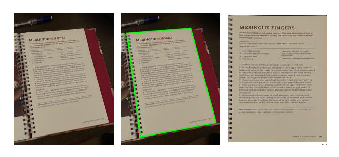

# **DocuScanner Flask**

A Webapp designed with flask for online document scanning. with-built in Deep-Learning powered perspective correction. 



## **Usage**

Install all dependencies before proceeding. 
```bash
pip install -r requirements.txt
```

### **Running Locally**
1. Navigate to the app directory
``` bash
cd app
```
2. Run app with flask, changing the host and port to your needs.
```bash 
flask run --host=0.0.0.0 --port=5001
```

### **Garbage Collection**


## **How it All Works** 


### **Image Segmentation** 

The app utilizes deep learning to simplify a crucial step in the perspective correction process: Contour detection. 


### **Contour Repair**

### **Perspective Correction**


## **References**
TODO
