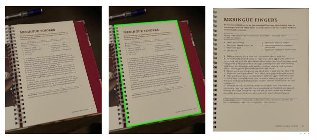

# **DocuScanner Flask**

A web app designed for online document scanning. Featuring built-in ML-powered perspective correction. 



## **Contents**

1. [Introduction](#introduction)
2. [Usage](#usage)
   - [Installation](#installation)
   - [Running Locally](#running-locally)
   - [Garbage Collection](#garbage-collection)
3. [How it All Works](#how-it-all-works)
   - [Image Segmentation](#image-segmentation)
   - [Bounding Quadrilateral Approximation](#bounding-quadrilateral-approximation)
   - [Perspective Correction](#perspective-correction)
4. [Future Work](#future-work)

## **Usage**

Install all dependencies before proceeding. 
```bash
pip install -r requirements.txt
```

### **Running Locally**
1. Navigate to the app directory
``` bash
cd app
```
2. Run app with flask, changing the host and port to your needs.
```bash 
flask run --host=0.0.0.0 --port=5001
```

3. Navigate to the server's location over http. Further instructions are located in the UI.  


## **How it All Works** 

The general workflow is as follows 


The complex components of the workflow are explained below

### **Image Segmentation** 

We utilize deep learning to simplify a crucial step in the perspective correction process: contour detection. 
on 
The model is custom UNet for binary segmentation of rectangular documents.

 Implementation details on this model can be found in this repo: https://github.com/LukeIngram/DocuSegement-Pytorch

Example inference:


These masks remove all other subjects from the image, which greatly improves the accuracy of the contour detection algorithms.

### **Bounding Quadrilateral Approximation**

Four corner points are required for accurate perspective correction, and in the case where the input isn't a quadrilateral, a minimum bounding one is computed around the subject. 

Approximation example: 


### **Perspective Correction**

The core feature of this app is the *perspective transform*. 


## **Future Work**

* Containerization
* Device Camera Support
* event logging
* file cleanup (both uploads and outbox)

